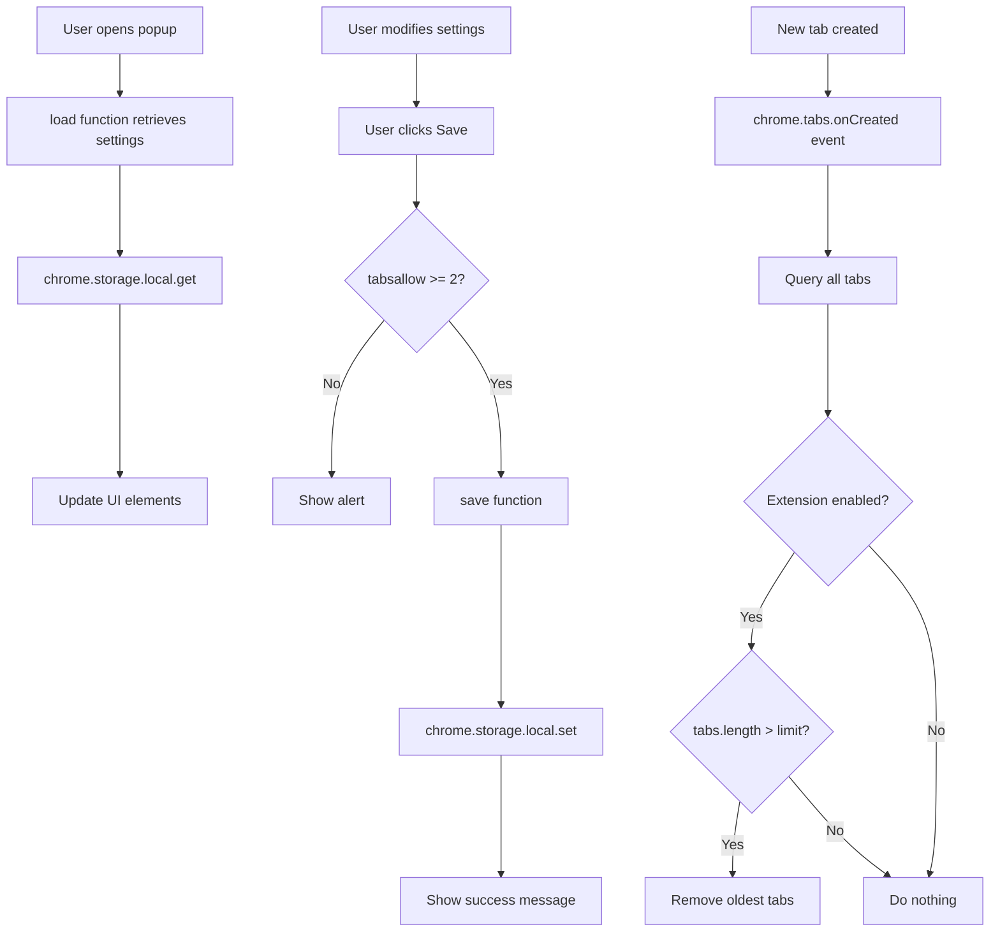

## Overview

Tab Closer is a Chrome Extension built on **Manifest V3** that automatically manages browser tabs by limiting the total number of open tabs. When the tab limit is exceeded, the extension automatically closes the oldest tabs to maintain the configured threshold.

## Architecture Pattern

The extension follows the standard Chrome Extension Manifest V3 architecture with three main components:

<Steps>
  <Step title="Service Worker (background.js)">
    Runs in the background and listens for tab events using the `chrome.tabs` API
  </Step>
  <Step title="Popup Interface (popup.html + script.js)">
    Provides a user interface for configuration and settings management
  </Step>
  <Step title="Chrome Storage API">
    Persists user settings across browser sessions
  </Step>
</Steps>

## File Structure

```plaintext
tab-closer/
├── manifest.json          # Extension configuration (Manifest V3)
├── background.js          # Service worker with tab management logic
├── popup.html            # Popup UI structure
├── script.js             # Popup logic and user interaction
├── style.css             # UI styling
└── images/
    └── 48.png            # Extension icon
```

## Manifest V3 Configuration

The extension uses Chrome Extension Manifest V3, which introduces service workers instead of background pages.

```json manifest.json
{
    "manifest_version": 3,
    "name": "Tab Closer",
    "version": "1.0.1",
    "description": "Chrome Extension to close all tabs you are not using.",
    "permissions": [
        "tabs",
        "storage"
    ],
    "background": {
        "service_worker": "background.js"
    },
    "action": {
        "default_icon": {              
          "48": "images/48.png"  
        },
        "default_title": "Tab Closer",   
        "default_popup": "popup.html"  
      }
}
```

<Info>
  Manifest V3 replaces background pages with service workers, which are event-driven and don't run continuously. This improves performance and resource usage.
</Info>

### Required Permissions

<ParamField path="tabs" type="permission">
  Grants access to the `chrome.tabs` API for querying, creating, and removing tabs
</ParamField>

<ParamField path="storage" type="permission">
  Enables use of `chrome.storage.local` API for persisting user settings
</ParamField>

## Service Worker Architecture

The service worker (`background.js`) implements the core tab management logic using an event-driven model.

### Tab Creation Event Listener

The extension listens for the `chrome.tabs.onCreated` event to detect when new tabs are opened:

```javascript background.js
chrome.tabs.onCreated.addListener(function (tab) {
    chrome.tabs.query({}, function (tabs) {
        // Validate that the toggle is enabled
        let fs = "";
        chrome.storage.local.get('fs', function (result) {
            fs = result.fs;
            if (fs) { // Toggle is ON
                let cantidadTabs = 0;
                chrome.storage.local.get('tabsallow', function (result) {
                    cantidadTabs = result.tabsallow;
                    // Validate that allowed tabs is >= 2
                    if (cantidadTabs >= 2) {
                        if (tabs.length > cantidadTabs) {
                            for (let i = 0; i < tabs.length - cantidadTabs; i++) {
                                try {
                                    chrome.tabs.remove(tabs[i].id, function () { });
                                } catch (error) {
                                    console.log(error);
                                }
                            }
                        }
                    }
                });
            }
        });
    });
});
```

<Accordion title="How the tab closing logic works">
  1. **Event Detection**: When a new tab is created, the `onCreated` listener fires
  2. **Storage Check**: Retrieves the `fs` (feature switch) value to see if the extension is enabled
  3. **Tab Count Check**: Retrieves the `tabsallow` value to get the user's configured limit
  4. **Validation**: Ensures `tabsallow >= 2` to prevent closing all tabs
  5. **Tab Removal**: If current tabs exceed the limit, removes the oldest tabs (lowest indices in the tabs array)
  6. **Error Handling**: Wraps tab removal in try-catch to handle potential API errors
</Accordion>

<Warning>
  The extension closes tabs starting from index 0 (oldest tabs first). Chrome does not guarantee tab order, so older tabs are typically those opened first.
</Warning>

### Chrome APIs Used

#### chrome.tabs API

<ParamField path="chrome.tabs.onCreated" type="event">
  Fires when a tab is created. The listener receives the new tab object.
</ParamField>

<ParamField path="chrome.tabs.query()" type="method">
  Retrieves all tabs matching specified criteria. Called with empty object `{}` to get all tabs.
</ParamField>

<ParamField path="chrome.tabs.remove()" type="method">
  Closes one or more tabs. Takes a tab ID or array of tab IDs.
</ParamField>

#### chrome.storage API

<ParamField path="chrome.storage.local.get()" type="method">
  Retrieves items from local storage. Used to access:
  - `fs`: Boolean indicating if the extension is enabled
  - `tabsallow`: Number indicating the maximum allowed tabs
</ParamField>

<ParamField path="chrome.storage.local.set()" type="method">
  Stores items in local storage. Returns a Promise in the popup script.
</ParamField>

## Popup Interface Architecture

The popup provides a user-friendly interface for configuring the extension.

### HTML Structure

The popup is a compact 200x240px interface with:

```html popup.html
<body>
    <h4>Tab Closer Chrome Extension</h4>
    
    <!-- Toggle switch for enabling/disabling -->
    <div class="flipswitch">
        <input type="checkbox" name="flipswitch" class="flipswitch-cb" id="fs" checked>
        <label class="flipswitch-label" for="fs">
            <div class="flipswitch-inner"></div>
            <div class="flipswitch-switch"></div>
        </label>
    </div>
    
    <!-- Tab limit input -->
    <h5>Cantidad de Tabs permitidas (2+)</h5>
    <div>
        <input type="number" class="css-input" id="tabsallow"/>
    </div>
    
    <!-- Save button -->
    <div>
        <button class="testbutton" id="button">Save</button>
    </div>
    
    <!-- Success message -->
    <div id="labelverde" style="color: rgb(8, 136, 8); text-align: center; visibility: hidden;">
        <h4>Saved!</h4>
    </div>
</body>
```

### Popup Script Logic

The `script.js` file handles user interactions and storage operations:

```javascript script.js
const checkbox = document.getElementById('fs')
const button = document.getElementById('button')

function save() {
  const tabsallow = document.getElementById('tabsallow').value;
  if(tabsallow >= 2){
    chrome.storage.local.set({ fs: checkbox.checked }).then(() => {
      chrome.storage.local.set({ tabsallow: tabsallow }).then(() => {
        document.getElementById("labelverde").style.visibility="visible";
      });
    });
  }else{
    alert('La cantidad debe ser mayor que uno!')
  }
}

button.addEventListener('click', function() {
  save();
});

function load() {
  let fs = "";
  let cantidadTabs = 2;
  chrome.storage.local.get('fs', function (result) {
      fs = result.fs;
      if(!fs){
        checkbox.checked = false;
      }
  });
  chrome.storage.local.get('tabsallow', function (result) {
    cantidadTabs = result.tabsallow;
    document.getElementById('tabsallow').value = parseInt(cantidadTabs);
  });
} 

load();
```

<Accordion title="Popup initialization flow">
  1. **DOM Ready**: Script executes after popup HTML loads
  2. **Load Settings**: `load()` function retrieves stored settings from `chrome.storage.local`
  3. **Update UI**: Checkbox and number input are populated with saved values
  4. **User Interaction**: When user clicks Save, `save()` validates and stores settings
  5. **Validation**: Ensures `tabsallow >= 2` before saving
  6. **Feedback**: Shows "Saved!" message on successful save
</Accordion>

## Data Flow Diagram



## Key Design Decisions

<Note>
  **Minimum tab limit of 2**: The extension enforces a minimum of 2 allowed tabs to prevent users from accidentally closing all tabs and losing browser functionality.
</Note>

<Note>
  **Promise-based storage in popup**: The popup script uses the Promise-based `chrome.storage.local.set().then()` syntax, while the service worker uses callback-based syntax for compatibility.
</Note>

<Warning>
  **Nested callbacks in service worker**: The background.js uses nested callbacks for storage operations, which could be refactored to use Promises or async/await for better readability.
</Warning>

## Performance Considerations

### Service Worker Lifecycle

Manifest V3 service workers are event-driven and may be terminated by Chrome when idle:

- The service worker activates when `chrome.tabs.onCreated` fires
- Chrome automatically handles service worker lifecycle
- All state must be stored in `chrome.storage` (not in-memory variables)

### Storage Performance

- `chrome.storage.local` is asynchronous and doesn't block UI
- Storage operations are relatively fast but should be minimized
- Current implementation queries storage on every tab creation (potential optimization opportunity)

## Security Model

The extension follows Chrome's security best practices:

- **Limited permissions**: Only requests `tabs` and `storage` permissions
- **No host permissions**: Doesn't access page content or network requests
- **No eval()**: All code is static (required by Manifest V3)
- **CSP compliant**: No inline scripts in HTML files

## Extension Lifecycle

<Steps>
  <Step title="Installation">
    Extension is installed and service worker registers with Chrome
  </Step>
  <Step title="First Configuration">
    User clicks extension icon, opens popup, and configures settings
  </Step>
  <Step title="Runtime Monitoring">
    Service worker monitors `chrome.tabs.onCreated` events
  </Step>
  <Step title="Tab Management">
    When new tab is created, service worker checks settings and closes excess tabs
  </Step>
</Steps>

## Debugging Tips

<Accordion title="How to debug the service worker">
  1. Navigate to `chrome://extensions/`
  2. Enable "Developer mode" in top right
  3. Find Tab Closer extension
  4. Click "Inspect views: service worker" to open DevTools
  5. Check Console for any errors or `console.log()` output
</Accordion>

<Accordion title="How to debug the popup">
  1. Click the extension icon to open popup
  2. Right-click inside popup
  3. Select "Inspect"
  4. DevTools opens for the popup context
</Accordion>

## Browser Compatibility

The extension is designed for Chrome and Chromium-based browsers:

- **Chrome**: Version 88+ (Manifest V3 support)
- **Edge**: Version 88+ (Chromium-based)
- **Brave**: Recent versions with Manifest V3 support
- **Opera**: Version 74+ (Chromium-based)

<Warning>
  Firefox uses a different extension API (WebExtensions) and would require modifications to support.
</Warning>